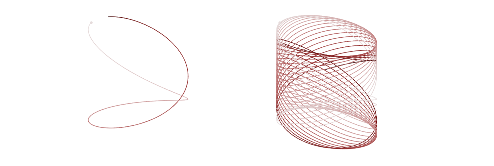

# Mathematical Statistics
Math 392 | Reed College | Spring 2018

### Schedule

#### Week 1: Intro

**Monday**
- Parameters and statistics
- Example: stratified sampling
- Reading: p. , 339 - 340

**Wednesday**
- That

**Friday**
- The other 