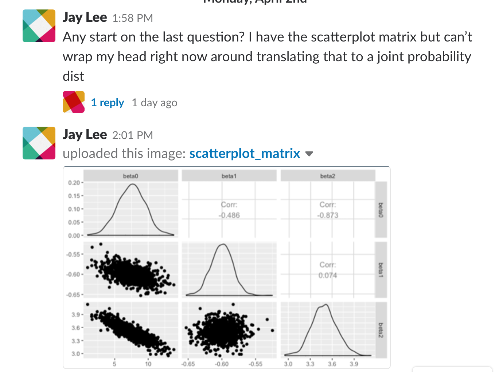

```{r, echo=FALSE, message=FALSE, warning=FALSE}
# Install these packages first
knitr::opts_chunk$set(message = FALSE)
library(tidyverse)
library(readr)
library(knitr)
```


# Matrix Algebra in R


## Forming matrices {.build}

You can craft a matrix in two ways:

1. Forming it from a vector with the `matrix()` function
2. Forming a `data.frame()` then coercing it with `as.matrix()`

From a vector:

```{r}
matrix(data = c(1:6), nrow = 2, byrow = T)
```


## Forming matrices {.build}

You can craft a matrix in two ways:

1. Forming it from a vector with the `matrix()` function
2. Forming a `data.frame()` then coercing it with `as.matrix()`

From a dataframe:

```{r}
df <- data.frame(x0 = c(1, 1, 1, 1, 1),
                 x1 = c(7, 4, 7, 6, -1),
                 x2 = c(-4, -1, -1, 0, 2))
X <- as.matrix(df)
X
```


## Some basic operations {.smaller .build}

```{r}
t(X)
t(X) %*% X
solve(t(X) %*% X)
```


## Who needs lm? {.smaller .build}

Simulate data.

```{r}
B <- c(-3, .5, 2)
sig_sq <- 2.25
epsilon <- rnorm(5, mean = 0, sd = sqrt(sig_sq))
Y <- X %*% B + epsilon
```

Estimate coefficients.

```{r}
solve(t(X) %*% X) %*% t(X) %*% Y
df <- data.frame(df, Y)
coef(m1 <- lm(Y ~ x1 + x2, data = df))
```


## What about inference? {.build .smaller}

First we need to estimate back $\sigma^2$.

```{r}
epsilon_hat <- m1$residuals
S_sq <- 1/(5 - 2 - 1) * sum(epsilon_hat^2)
```

Which we can plug into our familiar expression.

```{r}
var_B <- S_sq * solve(t(X) %*% X)
sqrt(diag(var_B))
summary(m1)$coef
```


# Resampling methods

## Two methods for intervals {.build}

There are two general approaches to getting bootstrap intervals for your regression estimates (for $\beta$, $\hat{E}(Y|X)$, $[Y|X]$):

1. Bootstrap the **cases**.
2. Bootstrap the **residuals**.


##

### Aside: {.smaller}

Bootstrap is not a good idea when your you have few observations, so we'll be working with an expanded version of our simulated data set.

```{r}
set.seed(8134)
n <- 35
x0 <- 1
x1 <- rnorm(n)
x2 <- rnorm(n)
X <- as.matrix(data.frame(x0, x1, x2))
B <- c(-3, .5, 2)
sig_sq <- 2.25
epsilon <- rnorm(n, mean = 0, sd = sqrt(sig_sq))
Y <- X %*% B + epsilon
df <- data.frame(X, Y)
```


## Bootstrap the cases {.build}

```{r}
B1 <- sample_frac(df, replace = TRUE)
head(B1)
B2 <- sample_frac(df, replace = TRUE)
head(B2)
```


## Compute estimates for each B {.build}

```{r}
mB1 <- lm(Y ~ x1 + x2, data = B1)
coef(mB1)
mB2 <- lm(Y ~ x1 + x2, data = B2)
coef(mB2)
```


## Full bootstrap {.build .smaller}

```{r cache=T}
it <- 5000
beta_hp <- rep(NA, it)
for (i in 1:it) {
  B <- sample_frac(df, replace = TRUE)
  beta_hp[i] <- lm(Y ~ x1 + x2, data = B)$coef[2]
}
sd(beta_hp)
m1 <- lm(Y ~ x1 + x2, data = df)
summary(m1)$coef
```


## Thoughts on that... {.builds}

It seemed to work fine but it is a bit odd because the bootstrap procedure suggests that *both* the $X$ and the $Y$ are random variables.

Can we devise a procedure that is in closer accordance with our idea of regression as conditioning on the values of $X$?

*After conditioning on the values of $X$, $Y$ is only random through the random vector $\epsilon$. Why don't we bootstrap that?*


## Bootstrap residuals {.build .smaller}

```{r cache=T}
it <- 5000
beta_hp <- rep(NA, it)
m1 <- lm(Y ~ x1 + x2, data = df)
B <- df
for (i in 1:it) {
  B$Y <- m1$fit + sample(m1$res, replace = TRUE)
  beta_hp[i] <- lm(Y ~ x1 + x2, data = B)$coef[2]
}
sd(beta_hp)
summary(m1)$coef
```


# The MVN

##

 
 

## Multivariate Normal Distribution

```{r echo = FALSE}
set.seed(587221)
```


The general form of the multivariate Normal distribution is

$$
\boldsymbol{X} \sim N(\boldsymbol{\mu}, \boldsymbol{\Sigma})
$$

Where $\boldsymbol{X}$ is a $n \times p$ matrix, $\boldsymbol{\mu}$ is a $p \times 1$ mean vector, and $\boldsymbol{\Sigma}$ is a $p \times p$ variance/covariance matrix.

You can access densities and random number generated for this distribution via the `dmvnorm()` and `rmvnorm` functions

```{r eval = FALSE}
library(mvtnorm)
rmvnorm(n, mean = mu, sigma = Sigma)
```


## Simulating from MVN {.build .smaller}

First, specify parameters,

```{r}
mu_vec <- c(1, 2, 3)
sigma_mat <- matrix(c(.5,  0, .7,
                       0, .5,  0,
                      .7,  0,  2),
                    ncol = 3, byrow = TRUE)
sigma_mat
```


## Simulating from MVN, cont. {.build .smaller}

then, generate random variables.

```{r echo = FALSE}
library(mvtnorm)
```

```{r}
rmvnorm(1, mean = mu_vec, sigma = sigma_mat)
rmvnorm(1, mean = mu_vec, sigma = sigma_mat)
rmvnorm(10, mean = mu_vec, sigma = sigma_mat)
```


## Visualizing the MVN

```{r}
X <- rmvnorm(100, mean = mu_vec, sigma = sigma_mat)
library(GGally)
ggpairs(as.data.frame(X))
```


# Generalized Linear Models

## Logistic regression

We can write a function to calculate the Bernoulli log-likelihood.

```{r}
l_bern <- function(B, X, Y) {
  p <- 1/(1 + exp(- X %*% B))
  sum(Y * log(p) + (1 - Y) * log(1 - p))
}
```


## Simulate Bernoulli data {.build .smaller}

First set the size of the data.

```{r}
p <- 1
n <- 35
```

Then generate the $X$.

```{r}
library(mvtnorm)
X <- cbind(1, rmvnorm(n, mean = rep(0, p), sigma = diag(p)/2))
X
```


## Simulate Bernoulli data, cont. {.build .smaller}

Then set $B$.

```{r}
B <- c(-1, 2)
```

Finally, generate $Y$.

```{r}
Y <- rbinom(n, size = 1, prob = 1/(1 + exp(- X %*% B)))
Y
Y <- rbinom(n, size = 1, prob = 1/(1 + exp(- X %*% B)))
Y
```


## Compute log-likelihood {.build .smaller}

```{r}
l_bern(B, X, Y)
l_bern(c(0, 0), X, Y)
```

For a whole range of values...

```{r}
B0 <- seq(-7, 5, length.out = 300)
B1 <- seq(-4, 8, length.out = 300)
l_surface <- matrix(0, nrow = length(B0), ncol = length(B1))
for(i in 1:nrow(l_surface)) {
  for(j in 1:ncol(l_surface)) {
    l_surface[i, j] <- l_bern(B = c(B0[i], B1[j]), X, Y)
  }
}
```


##

```{r}
library(plotly)
plot_ly(z = ~l_surface) %>% 
  add_surface(x = B0, y = B1)
```


## Numerical Optimization {.build}

You could try your luck with all-purpose `optim()`...

```{r}
optim(par = c(0, 0), fn = l_bern, X = X, Y = Y)
```


## Numerical Optimization {.build}

Or look for a dedicated optimizer.

```{r}
library(maxLik)
maxLik(l_bern, start = c(0, 0), X = X, Y = Y)
df <- data.frame(Y = Y, x1 = X[, 2])
coef(glm(Y ~ x1, data = df, family = "binomial"))
```


## Sample size and likelihood

What happens when we draw $n = 350$ instead of $n = 35$?

```{r}
n <- 350
X <- cbind(1, rmvnorm(n, mean = rep(0, p), sigma = diag(p)/2))
Y <- rbinom(n, size = 1, prob = 1/(1 + exp(- X %*% B)))
l_surface <- matrix(0, nrow = length(B0), ncol = length(B1))
for(i in 1:nrow(l_surface)) {
  for(j in 1:ncol(l_surface)) {
    l_surface[i, j] <- l_bern(B = c(B0[i], B1[j]), X, Y)
  }
}
```


## {.build}

```{r}
library(plotly)
axz <- list(range = c(-350, -150))
plot_ly(z = ~l_surface) %>% 
  add_surface(x = B0, y = B1) %>%
  layout(scene = list(zaxis = axz))
```


## MLE as a RV {.build}

Any $\hat{\theta}_{MLE}$ is a function of (random) data, therefore it's a random variable with a distribution. If $\hat{\theta}_{MLE}$ is a *vector* then the random vector has a *joint* distribution.

```{r}
n <- 35
X <- cbind(1, rmvnorm(n, mean = rep(0, p), sigma = diag(p)/2))
Y <- rbinom(n, size = 1, prob = 1/(1 + exp(- X %*% B)))
ml <- maxLik(l_bern, start = c(0, 0), X = X, Y = Y)
ml$estimate
Y <- rbinom(n, size = 1, prob = 1/(1 + exp(- X %*% B)))
ml <- maxLik(l_bern, start = c(0, 0), X = X, Y = Y)
ml$estimate
```


## Simulation {.build}

We can fully simulate the joint distribution of $\hat{\theta}_{MLE}$.

```{r cache = TRUE}
it <- 500
MLE <- matrix(rep(NA, it * (p + 1)), ncol = p + 1)
for (i in 1:it) {
  Y <- rbinom(n, size = 1, prob = 1/(1 + exp(- X %*% B)))
  ml <- maxLik(l_bern, start = c(0, 0), X = X, Y = Y)
  MLE[i, ] <- ml$estimate
}
MLE_35 <- as.data.frame(MLE)
sapply(MLE_35, mean)
```


## {.build}

```{r}
ggpairs(MLE_35)
```

Looks a bit skewed and a bit biased. How does this change with sample size?


## Larger sample simulation {.build}

```{r cache = TRUE}
n <- 350
X <- cbind(1, rmvnorm(n, mean = rep(0, p), sigma = diag(p)/2))
MLE <- matrix(rep(NA, it * (p + 1)), ncol = p + 1)
for (i in 1:it) {
  Y <- rbinom(n, size = 1, prob = 1/(1 + exp(- X %*% B)))
  ml <- maxLik(l_bern, start = c(0, 0), X = X, Y = Y)
  MLE[i, ] <- ml$estimate
}
MLE_350 <- as.data.frame(MLE)
sapply(MLE_350, mean)
```


## {.build}

```{r}
ggpairs(MLE_350)
```

Bias seems to be going away, variance is shrinking (consistent?) and it's starting to look MVN...


# Inference for MLEs

## Bootstrap {.build}

The bootstrap is primarily useful to estimating the standard error of parameter estimates by plugging in the ecdf for the true distribution function when doing sampling.

Conventional residuals aren't defined for logistic regression, and we can't just bootstrap the y's, so we're left with bootstrapping the *cases*.

## {.build}

```{r}
n <- 35
X <- cbind(1, rmvnorm(n, mean = rep(0, p), sigma = diag(p)/2))
Y <- rbinom(n, size = 1, prob = 1/(1 + exp(- X %*% B)))
MLE <- matrix(rep(NA, it * (p + 1)), ncol = p + 1)
for (i in 1:it) {
  bs_indices <- sample(1:n, replace = TRUE)
  X_bs <- X[bs_indices, ]
  Y_bs <- Y[bs_indices]
  ml <- maxLik(l_bern, start = c(0, 0), X = X_bs, Y = Y_bs)
  MLE[i, ] <- ml$estimate
}
MLE_bs <- as.data.frame(MLE)
```


## {.build}

```{r}
ggpairs(MLE_bs)
```


## {.build .smaller}

### Bootstrap SE

```{r}
sapply(MLE_bs, sd)
```

### Large Sample SE

```{r}
df <- data.frame(Y, x1 = X[, 2])
summary(glm(Y ~ x1, data = df, family = "binomial"))$coef[, 2]
```

### Approx. Exact SE

```{r}
sapply(MLE_35, sd, na.rm = TRUE)
```


## Summary {.build}

- GLM coefficients are generally estimated via MLE.
- It's common to use numerical routines to find argmax.
- Inference on these estimates usually relies upon the asympotitic normality of the MLE but bootstrap is also an option.


