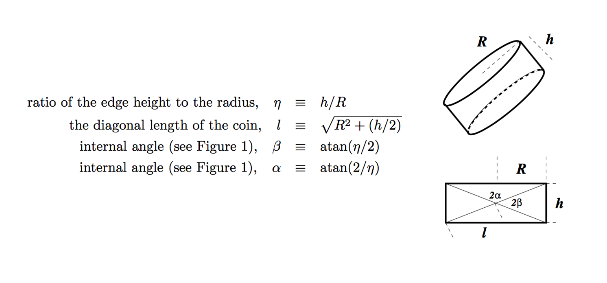
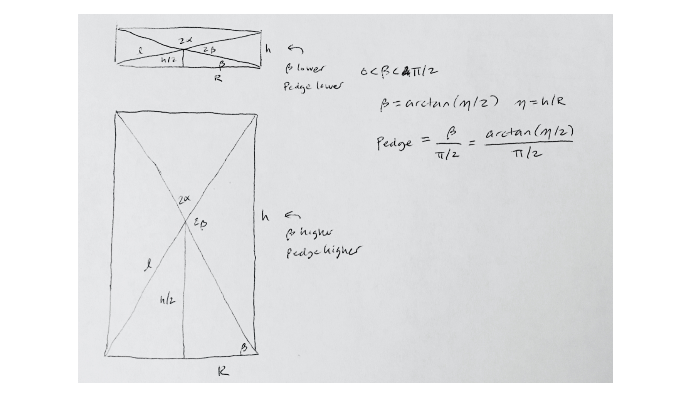
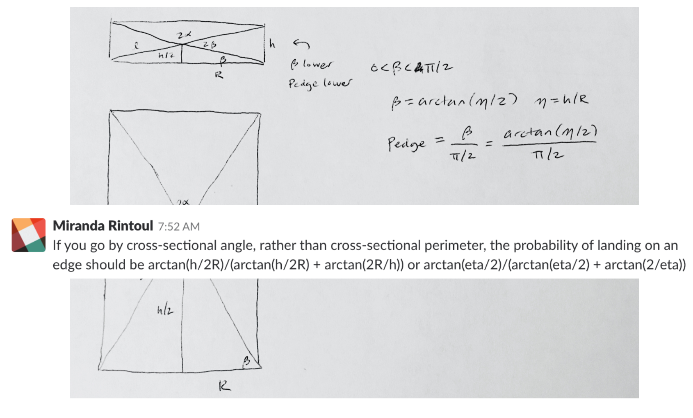
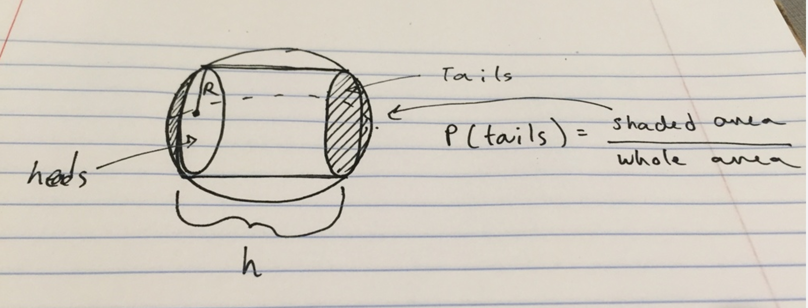

```{r, echo=FALSE, message=FALSE, warning=FALSE}
# Install these packages first
knitr::opts_chunk$set(message = FALSE)
library(tidyverse)
library(readr)
library(knitr)
```


# Bayesian Model Selection

## Three sided coin



## Model 1: Surface Area

$$p(h, R) = \frac{2\pi R h}{2\pi R^2 + 2\pi Rh}$$

$$p(\eta) = \frac{\eta}{1 + \eta}$$

## Model 2: Cross-sectional Length

$$ p(h, R) = \frac{h}{2(2R) + h}$$
$$
p(\eta) = \frac{\eta}{4 + \eta}
$$

## Model 3: Cross-sectional angle




## Model 3: Cross-sectional angle




## Model 3: Cross-sectional angle


$$
p(\eta) = \frac{\arctan (\eta/2)}{\arctan(\eta/2) + \arctan(2/\eta)}
$$

## Model 4: Spherical Surface Area



$$
p(\eta) = \,?
$$


# MCMC: Gibbs Sampling

## Changepoint problem

```{r echo = FALSE}
library(tidyverse)
n <- 60
m <- 38
mu <- 2
lambda <- 4
set.seed(47)
y_mu <- rpois(m, lambda = mu)
y_lambda <- rpois(n - m, lambda = lambda)
y <- c(y_mu, y_lambda)
df <- data.frame(t = 1:n,
                 y = y,
                 rate = rep(c("mu", "lambda"), c(m, n - m)))
ggplot(df, aes(x = t, y = y)) +
  geom_point() + geom_line()
```


##

```{r echo = FALSE}
# Y-twiddle
ggplot(df, aes(x = y)) +
  geom_bar()
# Separate Ys
ggplot(df, aes(x = y, fill = rate)) +
  geom_bar(position = "dodge2")

# Parameterize priors
alpha <- 10
beta <- 4
ggplot(data.frame(x = c(0, 12)), aes(x)) +
  stat_function(fun = dgamma, 
                args = list(shape = alpha, rate = beta))

nu <- 8
phi <- 2
ggplot(data.frame(x = c(0, 12)), aes(x)) +
  stat_function(fun = dgamma, 
                args = list(shape = nu, rate = phi))


# Gibbs sampler
it <- 10000
post_samples <- matrix(rep(NA, it * 3), ncol = 3)
colnames(post_samples) <- c("mu", "lambda", "m")

m_i <- 10 # initialize m
for (i in 1:it) {
  mu_i      <- rgamma(1, alpha + sum(y[1:m_i]), beta + m_i)
  lambda_i  <- rgamma(1, nu + sum(y[(m_i+1):n]), phi + (n - m_i))
  m_vec <- rep(NA, n - 1)
  for (j in 1:(n - 1)) {
    m_vec[j] <-  mu_i^(alpha + sum(y[1:j]) - 1) *
      exp(-(beta + j) * mu_i) *
      lambda_i^(nu + sum(y[(j+1):n]) - 1) *
      exp(-(phi + n - j) * lambda_i)
  }
  p <- m_vec/sum(m_vec)
  m_i <- sample(1:(n - 1), size = 1, prob = p)
  post_samples[i, "mu"]     <- mu_i
  post_samples[i, "lambda"] <- lambda_i
  post_samples[i, "m"]      <- m_i
}

joint_posterior <- data.frame(post_samples,
                              it = 1:it)
ggplot(joint_posterior, aes(x = it, y = m)) +
  geom_line()
joint_post <- joint_posterior %>%
  slice(seq(from = 5000, to = it, by = 5))
ggplot(joint_post, aes(x = mu)) +
  geom_density()
ggplot(joint_post, aes(x = lambda)) +
  geom_density()
ggplot(joint_post, aes(x = m)) +
  geom_bar()

df <- data.frame(rates = c(post_samples[, "mu"], post_samples[, "lambda"]),
                 parameter = factor(rep(c("mu", "lambda"), c(it, it))))
ggplot(df, aes(x = rates, fill = parameter)) +
  geom_density()
```

